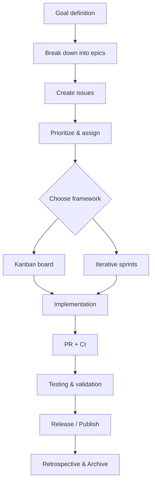

# Professional Workflow Notes
Concise, attractive, copy-paste ready README documenting a professional end-to-end workflow for software development and research publishing.

> Note: replace `YOUR_USERNAME/YOUR_REPO` in badge links and commands with your GitHub username and repository name.

[](LICENSE) [](docs/index.md) [](https://github.com/YOUR_USERNAME/YOUR_REPO/releases)

# Table of contents
1. Quick summary
2. Visual overview
3. Step-by-step professional procedure
4. Methods, tools, pros and cons (table)
5. Ideation and inspiration techniques
6. Literature research best practices
7. Drafting pseudocode and diagrams
8. Task breakdown example (lane detection)
9. Finish, release, and archive
10. How AI can help at each stage (models + concrete prompts)
12. Files and repo layout
14. Contributing and license

# Quick summary
This README explains a repeatable workflow from goal definition to delivery, including practical steps, tools, pros and cons, and concrete templates you can copy into issues, PRs, and docs.

# Visual overview



# 1. Step-by-step professional procedure

## Step 1 - Define the goal
- Output: one-paragraph goal + three measurable success criteria.
- Template:
  - Goal: `Short description of what we will deliver and why.`
  - Success criteria:
    1. `Criterion 1: measurable result or metric (for example: 10 Hz on Jetson Nano).`
    2. `Criterion 2: accuracy / performance threshold (for example: lateral error < 0.15 m).`
    3. `Criterion 3: deliverable (for example: reproducible ROS2 package + README + demo bag).`
- Tools: Markdown, Notion, Google Docs, Overleaf for papers.

## Step 2 - High-level breakdown
- Split the goal into 3 to 8 epics or modules.
- Example epics for lane following:
  1. Data collection and annotation
  2. Perception algorithm
  3. Control and steering computation
  4. Simulation and validation
  5. Documentation and publication

## Step 3 - Create issues
- Rule: one issue = one outcome, 1 to 5 working days.
- Issue template fields to include:
  - Title
  - Description
  - Acceptance criteria (list)
  - Estimate (days or story points)
  - Labels: epic, type (feature, bug, spike), priority
  - Assignee
  - Linked PR / related issues
- Tools: GitHub Issues, Jira

## Step 4 - Prioritize and assign
- Use a priority method: MoSCoW or RICE for objective decisions.
- Assign owners, set milestone or sprint.
- Re-triage weekly.

## Step 5 - Pick and set up project framework
- Quick rules:
  - Use Kanban for continuous flow and single contributor projects.
  - Use Iterative sprints for multi-person feature delivery.
  - Use Waterfall for linear deliverables like a paper with fixed deadlines.
  - Use Hybrid when you need both cadence and flexibility.

## Step 6 - Implementation and CI
- Branch per issue or feature: `feature/<short-name>`
- Write tests alongside code (unit tests, integration tests).
- Open PR with description, test results, and checklist.
- Tools: Git, GitHub Actions, GitLab CI, Docker

## Step 7 - Verification and validation
- For software run unit tests, integration tests, hardware-in-the-loop where needed.
- For research run reproducibility experiments, record seeds, configs, and datasets.
- Tools: pytest, rostest, evaluation scripts, experiment logs.

## Step 8 - Release and publish
- Tag a release, create release notes, publish artifacts (Docker image, pip wheel, paper PDF).
- For papers, upload to arXiv or target venue and track submission details.

## Step 9 - Retrospective and archive
- Short meeting or notes: what went well, what to improve, action items.
- Archive the final project board and tag the repo.

# 2. Methods, tools, pros and cons
Use this quick comparison table to choose a framework.

| Method | Common names | Advantages | Disadvantages | When to use |
|---|---:|---|---|---|
| Kanban | Continuous flow | Low overhead, flexible | Less timeboxed; possible scope drift | Solo or ops-style work |
| Iterative | Scrum, sprints | Predictable cadence, good alignment | Ceremonies overhead | Multi-person feature work |
| Waterfall | Phased | Clear sequence, easy for fixed scope | Inflexible to change | Regulatory or fixed-paper schedules |
| Hybrid | Scrumban | Balance of both | Can be complex to set rules | Teams needing cadence and adaptability |

# 3. Ideation and inspiration techniques
- Brainstorm timeboxed: 15 to 30 minutes, capture all ideas.
- Mind map: central prompt -> branches for data, method, evaluation.
- SCAMPER: substitute, combine, adapt, modify, put to other uses, eliminate, reverse.
- Prior art scan: read top 5 recent papers/repos and summarize 1 sentence each.

# 4. Literature research best practices
- Start with a clear query and inclusion criteria.
- Tools: Google Scholar, Semantic Scholar, arXiv, Connected Papers.
- Read 1-3 key papers deeply and skim 10-20 for context.
- Keep a single-line summary, key figures, datasets used, reproduction tips.
- Use Zotero or Mendeley for references and notes.

# 5. Drafting pseudocode and diagrams
- Pseudocode guidelines:
  - Keep language-agnostic and focus on input/output per function.
  - Example:

```text
function main_loop():
  frame = read_frame()
  preprocessed = preprocess(frame)
  lanes = detect_lanes(preprocessed)
  steering = compute_steering(lanes)
  publish(steering)
```

- Diagrams:
  - Use Mermaid for flowcharts in README.
  - Use PlantUML or diagrams.net for architecture; export as SVG.
  - Save diagrams under `images/` with descriptive names.

# 6. Task breakdown example - Real-time lane detection epic
Create 8 issues for an initial sprint. Titles and brief acceptance criteria:

1. `Spike: collect 50 annotated frames`
   - Acceptance: 50 images annotated, upload to `data/` and add README for annotation format.
2. `Implement preprocessing module`
   - Acceptance: function `preprocess(image)` returns normalized, undistorted image; unit tests included.
3. `Implement lane detection module`
   - Acceptance: function `detect_lanes(image)` returns lane centroids; baseline accuracy > 70% on sample set.
4. `Compute steering command`
   - Acceptance: `compute_steering(lanes)` outputs Twist-like object; simulated control works in RViz.
5. `Integrate ROS2 node skeleton`
   - Acceptance: Node subscribes to camera, publishes steering, example launch file included.
6. `Unit tests and CI pipeline`
   - Acceptance: pytest runs on PR and passes; CI configured in `.github/workflows`.
7. `Debug overlay and logging`
   - Acceptance: publish debug images to `/debug/image` topic; logging with config file.
8. `Documentation and demo`
   - Acceptance: `README.md` demo section and example rosbag with run commands.

# 7. How to finish and deliver the project
- Ensure CI green, tests passing, and acceptance criteria met.
- Create `v0.1` release with release notes:
  - What changed
  - How to run quick demo
  - Known issues and next steps
- Publish docs to GitHub Pages if you want a polished site.
- Run a 30-minute retrospective, note 3 improvements.

# 8. How AI can help at each stage (models and concrete prompts)
Below are suggestions with concrete prompts you can paste.

## Goal definition
- Model: ChatGPT (GPT-4o or GPT-4o-mini)
- Prompt: `Write a one paragraph goal and three measurable success criteria for a ROS2 lane-following node that must run at 10 Hz on a Jetson Nano with accuracy target X.`

## Ideation and survey
- Tool: Connected Papers + ChatGPT
- Prompt: `Summarize 5 recent approaches for monocular lane detection and list their pros/cons and datasets used.`

## Issue generation and sprint planning
- Tool: ChatGPT or GitHub Copilot
- Prompt: `Given epic "Real-time lane detection", produce 8 GitHub issue titles with 2-sentence descriptions and acceptance criteria.`

## Pseudocode to code and tests
- Tool: GitHub Copilot or ChatGPT code mode
- Prompt: `Generate a Python ROS2 node skeleton that subscribes to /camera/image_raw and publishes geometry_msgs/Twist after running detect_lanes(image). Include stub functions and unit tests using pytest.`

## CI workflow
- Tool: ChatGPT
- Prompt: `Create a GitHub Actions workflow that runs pytest and builds a Docker image on push to main.`

## Documentation polishing and release notes
- Tool: ChatGPT + Grammarly
- Prompt: `Write a short release note summarizing new features and run instructions for version 0.1.`

# 9. Images to add and where
Add these images to `images/` and reference relatively in the README.

- `images/workflow-overview.svg` - export the Mermaid or a polished diagram. Alt text: `Workflow overview flowchart`.
- `images/architecture.svg` - architecture or data flow diagram. Alt text: `System architecture diagram`.
- `images/hero-screenshot.png` - screenshot of demo or output. Alt text: `Demo screenshot showing lane detection overlay`.
- `images/ci-status.png` - example CI badge or screenshot (optional). Alt text: `CI pipeline status`.

If you cannot generate SVG, include PNG sized 800 to 1400 px wide.

# 10. Files:
```
professional-workflow-notes/
├- README.md
├- LICENSE
├- CONTRIBUTING.md
├- images/
├- docs/
│  └- index.md
├- src/
│  └- ...
├- data/
│  └- sample/
└- .github/
   └- workflows/
      └- deploy-docs.yml
```


# Appendices: Useful small templates to copy

## Issue template (paste into new issue)
```
Title: [Epic] Short title

Description:
- What: short description
- Why: value and goal
- Acceptance criteria:
  - [ ] Criterion 1
  - [ ] Criterion 2
- Estimate: 1-3 days
- Labels: epic/<name>, type:feature
```

## Pull request checklist
```
- [ ] Code compiles and tests pass
- [ ] Documented usage in README
- [ ] Linked to issue
- [ ] Reviewer: @your-teammate
```
